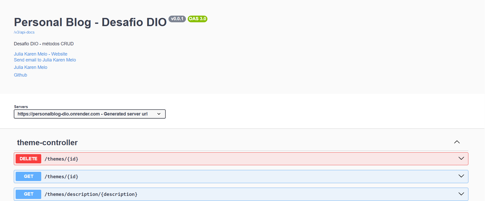

# Desafio API - DIO

Criando uma API Java RESTful com métodos CRUD. 
## Introdução

Com o objetivo de colocar em prática o aprendizado aprendido no módulo de API REST durante o bootcamp da DIO, foi realizado o desenvolvimento de uma API RESTful com a linguagem de programação Java e SpringBoot. 
## Resultados

Foram desenvolvidas duas entidades: Postage e Theme. Sendo o relacionamento delas ManyToOne. Sendo assim uma postage tem um theme, mas um theme pode ter várias postages. 

- Disponivel em: https://personalblog-dio.onrender.com/

Com isso, foram desenvolvidos os métodos CRUD para ambas as entidades: 
- Create: criação/post.
- Read: leitura/exibição.
- Update: atualização.
- Delete: remoção/delete. 

#### Documentação da API

- Métodos CRUD

- Entidades
  

